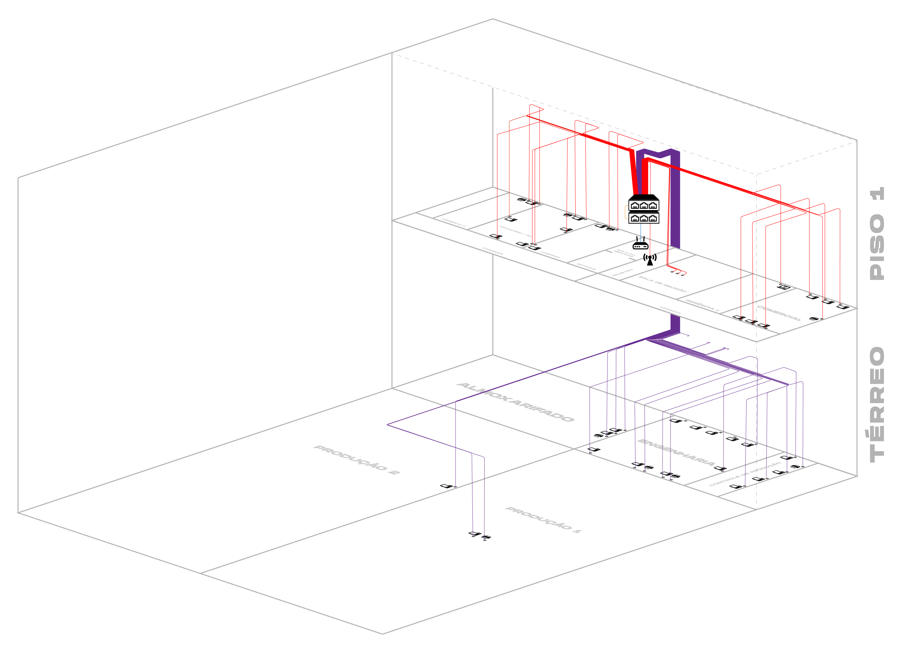
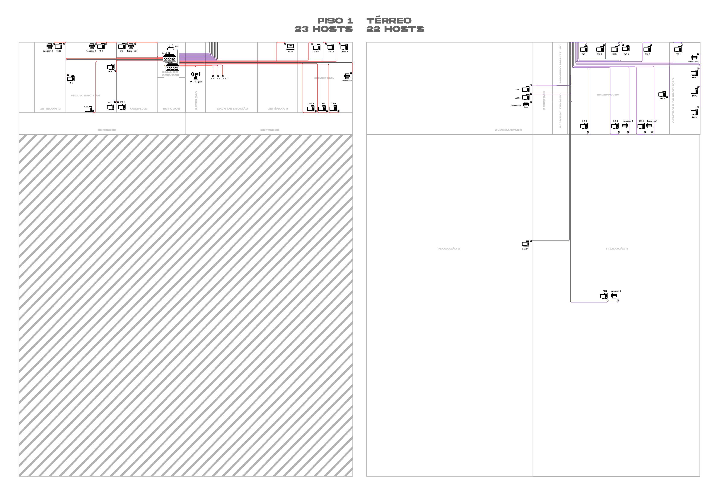
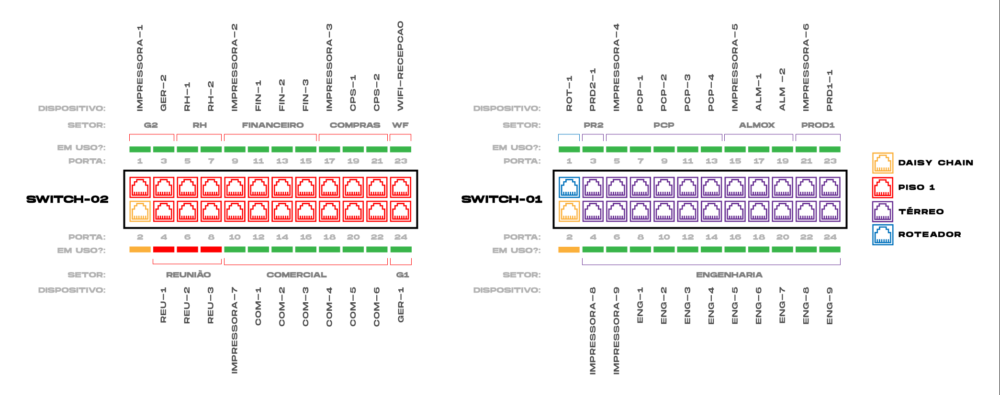

# Objetivo e Escopo
*Criar uma empresa com 40 ou mais hosts ativos.*

## Empresa
_DirtyTrash - Industria de Máquinas LTDA_

## Setores

- Engenharia
- Projeto e plano de controle de produção (PCP)
- Comercial
- Compras
- Recursos Humanos
- Financeiro
- Produção
- Reuniões
- Gerência

# Projeto - Rede Lan

## Descrição sumária
*Rede com  45 hosts em dois pisos distintos, separados em subredes para os 7 setores descritos acima.* 

## Tecnologias utilizadas
- *Roteador*
- *Switches*
- *Access Point*

## Diagrama lógico

Tamanho da Estrura

## Diagrama de Topologia

Disposição dos dispositivos na estrutura da empresa

[Visualizar em PDF de alta definição](/assets/mapa3d.pdf)

## Diagrama de Cabeamento

Disposição do cabeamento da rede

[Visualizar em PDF de alta definição](assets/cabeamento.pdf)

## Definição de cabeamento

[Visualizar em PDF de alta definição](/assets/mapadeconexoes.pdf)

[Clique aqui para baixar o projeto do Packet Tracer](assets/rede.pkt)

# Mapa de Conexões

| Setor                | Equipamento  | Porta | Descrição                  | Status  | Identificação do Cabo | Endereço IP   | Gateway       | Metragem |
|----------------------|--------------|-------|----------------------------|---------|-----------------------|---------------|---------------|----------|
| Gerência 2           | Switch-02    |     1 | Impressora-1               | Em uso  | VRM-1                 | XXXXX         | 192.168.10.11 |          |
| Sala do Servidor     | Switch-02    |     2 | ---- Daisy Chain ----      | Em Uso  | ORG-1                 | -------       | 192.168.10.1  | 1m       |
| Gerência 2           | Switch-02    |     3 | Ger-2                      | Em uso  | VRM-2                 | 192.168.10.40 | 192.168.10.11 |          |
| Reunião              | Switch-02    |     4 | Reu-1                      | Standby | VRM-3                 | 192.168.10.36 | 192.168.10.10 |          |
| Recursos Humanos     | Switch-02    |     5 | RH-1                       | Em uso  | VRM-4                 | 192.168.10.2  | 192.168.10.2  |          |
| Reunião              | Switch-02    |     6 | Reu-2                      | Standby | VRM-5                 | 192.168.10.37 | 192.168.10.10 |          |
| Recursos Humanos     | Switch-02    |     7 | RH-2                       | Em uso  | VRM-6                 | 192.168.10.3  | 192.168.10.2  |          |
| Reunião              | Switch-02    |     8 | Reu-3                      | Standby | VRM-7                 | 192.168.10.38 | 192.168.10.10 |          |
| Financeiro           | Switch-02    |     9 | Impressora-2               | Em uso  | VRM-8                 | XXXXX         | 192.168.10.3  |          |
| Comercial            | Switch-02    |    10 | Impressora-7               | Em uso  | VRM-9                 | XXXXX         | 192.168.10.5  |          |
| Financeiro           | Switch-02    |    11 | Fin-1                      | Em uso  | VRM-10                | 192.168.10.4  | 192.168.10.3  |          |
| Comercial            | Switch-02    |    12 | Com-1                      | Em uso  | VRM-11                | 192.168.10.7  | 192.168.10.5  |          |
| Financeiro           | Switch-02    |    13 | Fin-2                      | Em uso  | VRM-12                | 192.168.10.5  | 192.168.10.3  |          |
| Comercial            | Switch-02    |    14 | Com-2                      | Em uso  | VRM-13                | 192.168.10.8  | 192.168.10.5  |          |
| Financeiro           | Switch-02    |    15 | Fin-3                      | Em uso  | VRM-14                | 192.168.10.6  | 192.168.10.3  |          |
| Comercial            | Switch-02    |    16 | Com-3                      | Em uso  | VRM-15                | 192.168.10.9  | 192.168.10.5  |          |
| Compras              | Switch-02    |    17 | Impressora-3               | Em uso  | VRM-16                | XXXXX         | 192.168.10.4  |          |
| Comercial            | Switch-02    |    18 | Com-4                      | Em uso  | VRM-17                | 192.168.10.10 | 192.168.10.5  |          |
| Compras              | Switch-02    |    19 | Cps-1                      | Em uso  | VRM-18                | 192.168.10.42 | 192.168.10.4  |          |
| Comercial            | Switch-02    |    20 | Com-5                      | Em uso  | VRM-19                | 192.168.10.11 | 192.168.10.5  |          |
| Compras              | Switch-02    |    21 | Cps-2                      | Em uso  | VRM-20                | 192.168.10.43 | 192.168.10.4  |          |
| Comercial            | Switch-02    |    22 | Com-6                      | Em uso  | VRM-21                | 192.168.10.12 | 192.168.10.5  |          |
| Wi-Fi Recepção       | Switch-02    |    23 | Wi-fi Recepção             | Em uso  | VRM-22                | DHCP          | 192.168.10.1  |          |
| Gerência 1           | Switch-02    |    24 | Ger-1                      | Em uso  | VRM-23                | 192.168.10.13 | 192.168.10.11 |          |
| Roteador             | Switch-01    |     1 | Rot-1 (Roteador Principal) | Em uso  | BLU-1                 | 192.168.10.1  | 192.168.10.1  |          |
| Sala do Servidor     | Switch-01    |     2 | ---- Daisy Chain ----      | Em uso  | ORG-1                 | -------       | 192.168.10.1  | 1m       |
| Produção 2           | Switch-01    |     3 |  PRD2-1                    | Em uso  | VRD-1                 | 192.168.10.31 | 192.168.10.8  |          |
| Engenharia           | Switch-01    |     4 | Impressora-8               | Em uso  | VRD-2                 | XXXXX         | 192.168.10.7  |          |
| Controle de Produção | Switch-01    |     5 | Impressora-4               | Em uso  | VRD-3                 | XXXXX         | 192.168.10.9  |          |
| Engenharia           | Switch-01    |     6 | Impressora-9               | Em uso  | VRD-4                 | XXXXX         | 192.168.10.7  |          |
| Controle de Produção | Switch-01    |     7 | PCP-1                      | Em uso  | VRD-5                 | 192.168.10.32 | 192.168.10.9  |          |
| Engenharia           | Switch-01    |     8 | Eng-1                      | Em uso  | VRD-6                 | 192.168.10.22 | 192.168.10.7  |          |
| Controle de Produção | Switch-01    |     9 | PCP-2                      | Em uso  | VRD-7                 | 192.168.10.33 | 192.168.10.9  |          |
| Engenharia           | Switch-01    |    10 | Eng-2                      | Em uso  | VRD-8                 | 192.168.10.23 | 192.168.10.7  |          |
| Controle de Produção | Switch-01    |    11 | PCP-3                      | Em uso  | VRD-9                 | 192.168.10.34 | 192.168.10.9  |          |
| Engenharia           | Switch-01    |    12 | Eng-3                      | Em uso  | VRD-10                | 192.168.10.24 | 192.168.10.7  |          |
| Controle de Produção | Switch-01    |    13 | PCP-4                      | Em uso  | VRD-11                | 192.168.10.35 | 192.168.10.9  |          |
| Engenharia           | Switch-01    |    14 | Eng-4                      | Em uso  | VRD-12                | 192.168.10.25 | 192.168.10.7  |          |
| Almoxarifado         | Switch-01    |    15 | Impressora-5               | Em uso  | VRD-13                | XXXXX         | 192.168.10.6  |          |
| Engenharia           | Switch-01    |    16 | Eng-5                      | Em uso  | VRD-14                | 192.168.10.26 | 192.168.10.7  |          |
| Almoxarifado         | Switch-01    |    17 | Alm-1                      | Em uso  | VRD-15                | 192.168.10.20 | 192.168.10.6  |          |
| Engenharia           | Switch-01    |    18 | Eng-6                      | Em uso  | VRD-16                | 192.168.10.27 | 192.168.10.7  |          |
| Almoxarifado         | Switch-01    |    19 | Alm-2                      | Em uso  | VRD-17                | 192.168.10.21 | 192.168.10.6  |          |
| Engenharia           | Switch-01    |    20 | Eng-7                      | Em uso  | VRD-18                | 192.168.10.28 | 192.168.10.7  |          |
|                      | Switch-01    |    21 | Impressora-6               | Em uso  | VRD-19                | XXXXX         | 192.168.10.8  |          |
| Engenharia           | Switch-01    |    22 | Eng-8                      | Em uso  | VRD-20                | 192.168.10.29 | 192.168.10.7  |          |
| Produção 1           | Switch-01    |    23 | PRD1-1                     | Em uso  | VRD-21                | 192.168.10.41 | 192.168.10.8  |          |
| Engenharia           | Switch-01    |    24 | Eng-9                      | Em uso  | VRD-22                | 192.168.10.30 | 192.168.10.7  |          |
| Visitante            | Access Point |       | Celular Visitante          | Em uso  | Wireless              | DHCP          | 192.168.10.1  |          |

# Previsão de Custos

## Definição de Equipamentos
- *Roteador Mikrotik Routerboard 750* - **R$ 339,00**
- *Switch Unifi USW-Pro-24-POE* - **R$ 3.711,69** x2
- *Access Point UniFi AP HD* - **RS 1.853,19**

## Definição de Materiais
- *Cabeamento Cat.6 Furukawa U/UTP CM/CMR* - **R$ 3.000,00**
- *Soquetes RJ45 de parede* - **R$ 226,56‬**
- *Plugs RJ45* - **R$ 60,00**

## Mão de Obra
- *Hora Técnica*: **R$ 40,00**
- *Instalação*: **R$ 1.300,00**

## Resumo Orçamentário
- *Equipamentos:* **R$ 9.615.57**
- *Materiais:* **R$ 3.286,56**
- *Mão de Obra:* **R$ 1.340,00**
- *Frete e transporte:* **R$ 1.432,68**

- *Custo total:* **RS 15.677,81**

# Configurações da rede
- Os computadores das subredes **Produção 1** e **Produção 2** podem acessar a pasta **Projetos em andamento** na subrede **Engenharia**.
- Os computadores da subrede **Financeiro** podem acessar a subrede **Comercial**
- Os computadores da subrede **Gerência** podem acessar **todas** as subredes.
- Os computadores da subrede **Projetos e Plano de controle de Produção** podem acessar os a pasta **Projetos a serem executados** na subrede **Engenharia**.
- Os computadores das subredes **Financeiro**, **Compras** e **Recursos Humanos** estão limitadas à uma conexão de **20 MBit/s** cada.
- Os computadores das subredes **Engenharia**, **Projeto e plano de controle de produção**, **Produção** e **Gerência** não têm limitações de velocidade.
- Os compuitadores das subredes **Reunião** e **Comercial** estão limitadas à uma conexão de **100 MBit/s**.

# Equipe

Evelin Tomaz

João Vitor De Souza

